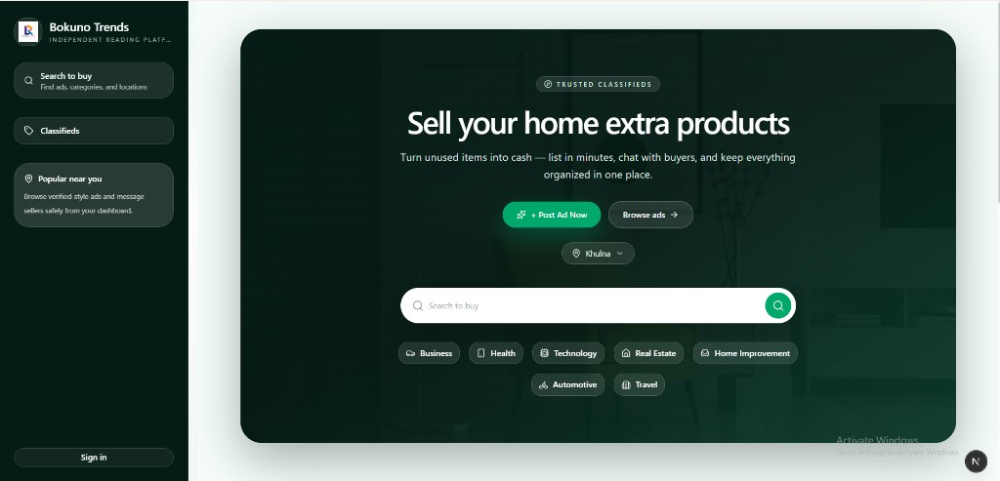
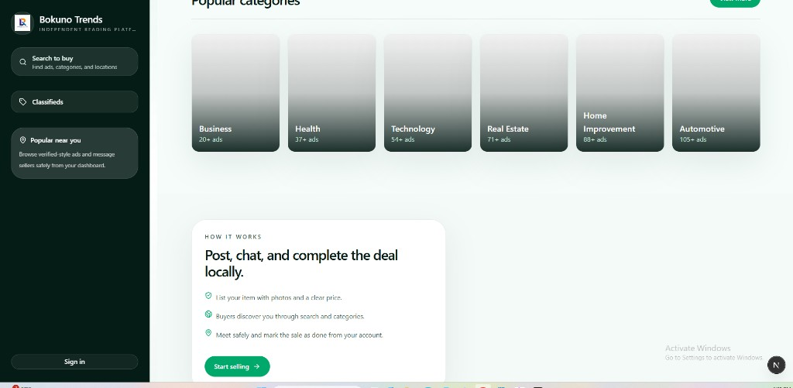
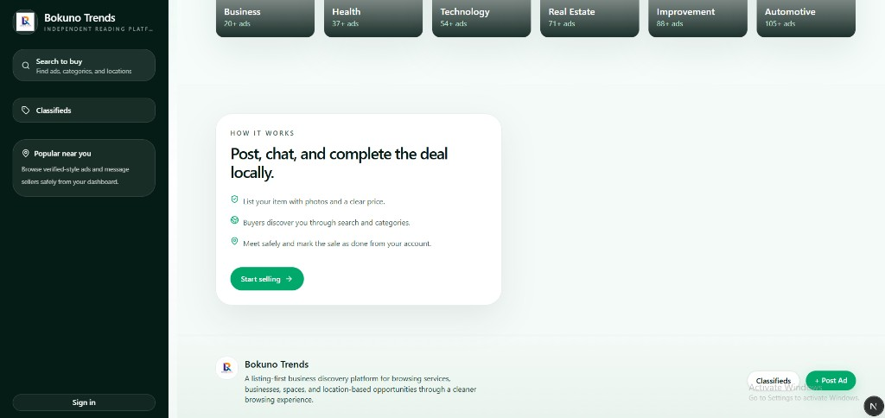
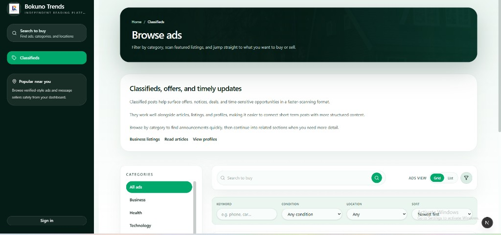
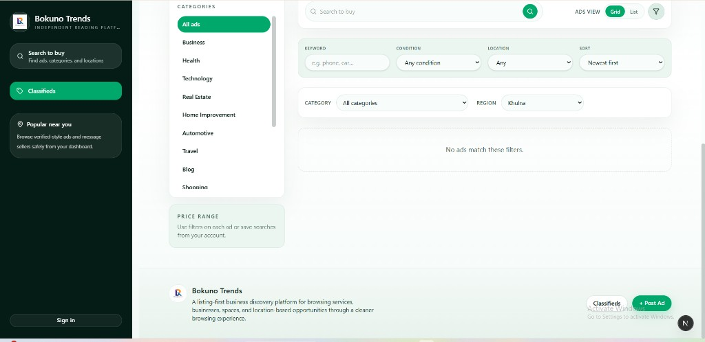

# Bokuno Trends

Next.js classifieds marketplace UI: dark emerald sidebar, home discovery, and browse-ads experience.

## UI screenshots

Images are stored in [`docs/screenshots/`](./docs/screenshots/) and render inline on GitHub.

### Home

**Hero — search, categories, and location**



**Popular categories and “How it works”**



**Home with footer**



### Classifieds

**Browse ads — hero and filters**



**Browse ads — filters and results**



## Development

```bash
pnpm install
pnpm dev
```

Open [http://localhost:3000](http://localhost:3000).
